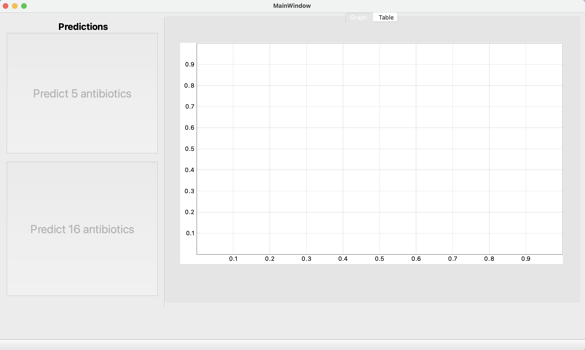
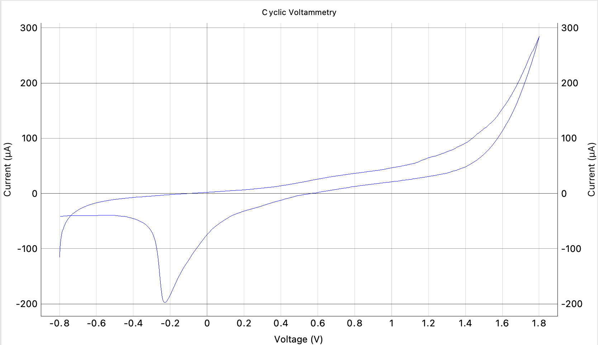
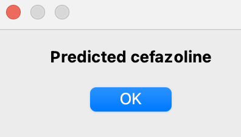
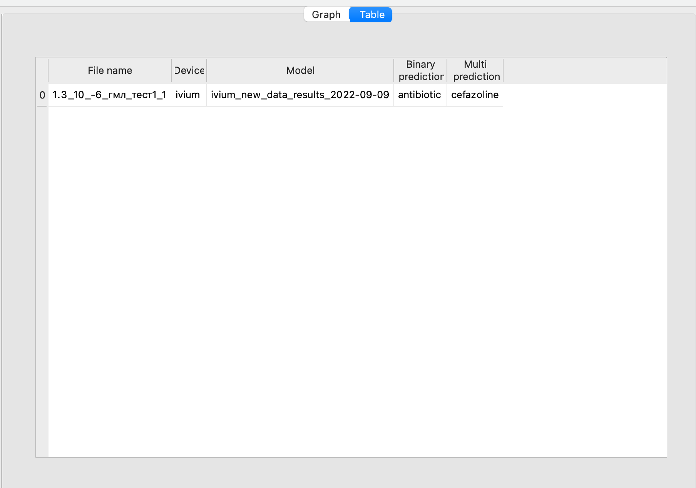

# milk-project-GUI

## Code purpose

This application is intended for testing cyclic voltammograms from the ivium instrument for determining the content of antibiotics in milk by electrochemical methods.

## Dependencies

To install dependencies run:
```bash
pip install -r requirements.txt
```

## Installation

Use git:
```bash
git clone git@github.com:ShockOfWave/milk-project-GUI.git
```

To make binary file use [pyinstaller](https://github.com/pyinstaller/pyinstaller).

## Usage

- Run app with python or use binary file
```bash
python -m MilkApp
```
<p align="center">
Start window



</p>

- Select file from ivium 

Application displays graph

<p align="center">
Graph example



</p>

- Make prediction

You will see small massage

<p align="center">
Prediction example



</p>

- Check full information and save it

Open tab table

<p align="center">
Table example



# License
## MIT

[](https://opensource.org/licenses/MIT)
